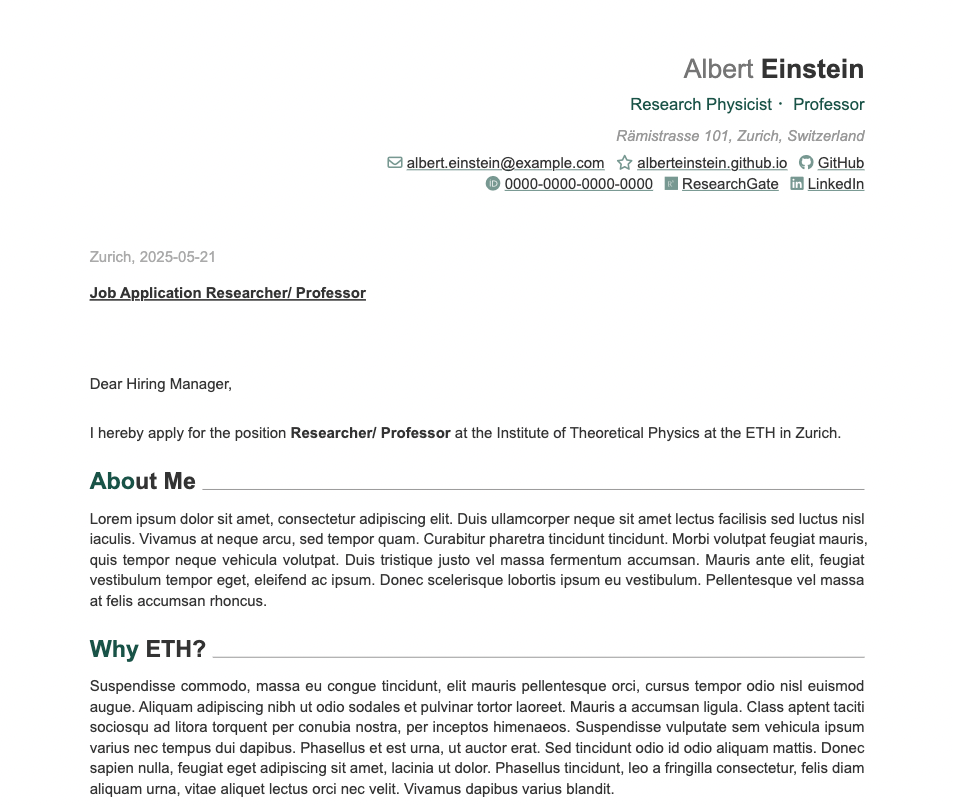

# Cover letter template based on Quarto and Typst.

This is a template for a cover letter based on Quarto and Typst. Find a template for a CV in my repo [CV-Typst-Template](https://github.com/serigra/CV-Typst-Template).

Large parts of this code are borrowed from Kazuharu Yanagimoto's [typst implementation](https://github.com/kazuyanagimoto/quarto-awesomecv-typst),
which again is based on Byungjin Park’s LaTex implementation ([Awesome-CV](https://github.com/posquit0/Awesome-CV)), which again is inspired by
Paul Tsouchlos’s [modern-cv](https://typst.app/universe/package/modern-cv/) in typst.



## Usage & Installation

To get the whole bundle of files including the `Letter_template.qmd` as well as the 
`_exensions` folder including the style files, use the following in your terminal:
```bash
quarto use template serigra/Letter-Typst-Template
```


To download only the _extensions folder itself, use the following:
```bash
quarto install extension serigra/Letter-Typst-Template
```

## Customization

### Content

* All the meta-data information (Name, Adress, Position, Contacts, etc.) can be set in the YAML-header of the .qmd file itself (as an example see `Letter_template.qmd`).
```bash
---
title: "Application Letter"
author:
  firstname: Albert
  lastname: Einstein
  address: "Rämistrasse 101, Zurich, Switzerland"
  position: "Research Physicist ・Professor"
  contacts:
    - icon: fa envelope
      text: albert.einstein@example.com
      url: "mailto:albert.einstein@example.com"

..etc..

```


* You can also add a profile image via the YAML-header as follows:

```bash
profile-photo: img/Foto_Albert_Einstein.jpg
```


### Colors, Fonts and Font Sizes

These can all be defined in `tpyst-template.typ`.

